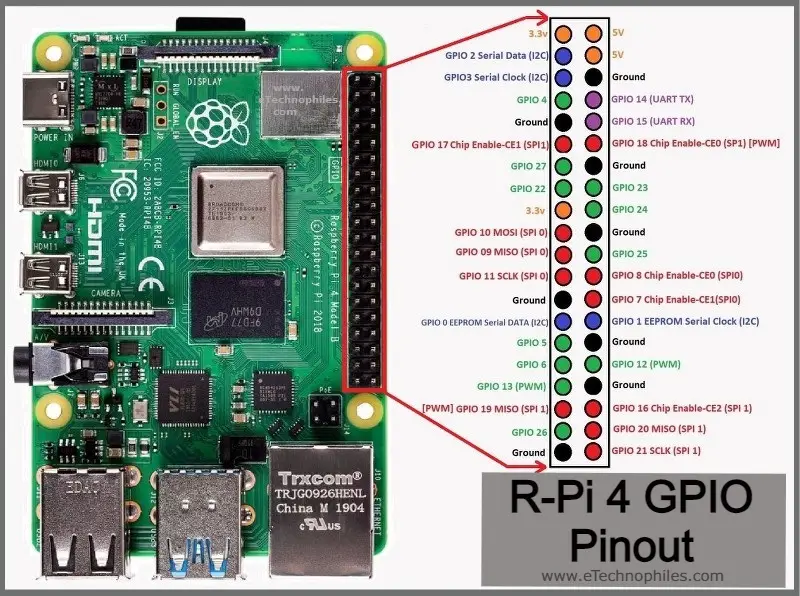

# Introduction 
There are different ways and tools to access BeagleBone's GPIO hardware from programs, but `sysfs` is a simple one that is supported by the **Linux kernel** and makes the devices visible in the file system so we can work from the command line without needing to write any code. For simple applications you can use it with the `sysfs` way, either interactively or by putting the commands in shell scripts.

`Sysfs` is a pseudo filesystem provided by the **Linux kernel** that makes information about various kernel subsystems, hardware devices, and device drivers available in user space through virtual files. GPIO devices appear as part of sysfs.

# RaspberryPi 4 (RBPi4)

**Note: This code and commands have been tested directly on a RaspberryPi4. The GPIO process for the RBPi4 is quiete different fro, the BeagleBone Boards, please considers the instructions for RBPi4 or BBB.**

## Basic considerations



## First steps

The system has some `sysfs` GPIO drivers already loaded, you can search for them at `/sys/class/gpio/`:
```
ls /sys/class/gpio
export  gpiochip0  gpiochip504  unexport
```
We'll look at how to use this interface next. Note that the device names starting with "gpiochip" are the GPIO controllers and we won't directly use them.

Next, the basic steps to use a GPIO pin from the `sysfs` interface are:

1. Export the pin.
2. Set the pin direction (input or output).
3. If an output pin, set the level to low or high.
4. If an input pin, read the pin's level (low or high).
5. When the gpio is not used anymore, unexport the pin.

Thus, to make available the GPIO24 as an output and write a logic 1, we should do:

Export the GPIO24 by
```
echo 24 >> /sys/class/gpio/export
```
then, the `gpio24` linksys file is abilable at
```
ls /sys/class/gpio/
export  gpio24  gpiochip0  gpiochip504  unexport
```
you can go now and observe inside the `gpio24` folder a series of configuration files
```
ls /sys/class/gpio/gpio24/
active_low  device  direction  edge  power  subsystem  uevent  value
```
the ones that we require for now are the `direction` and `value`, then, to make the GPIO24 an output write a logic 1 (3V):
```
echo out >> /sys/class/gpio/gpio24/direction
echo 1 >> /sys/class/gpio/gpio24/value
```

# BeagleBone Black

## Basic considerations


# Your work and description here

**Add here the description and the code that you develop to create a bash function to configure any GPIO to write (output) or read(input) by passing arguments to your command `gpio.sh`**.


